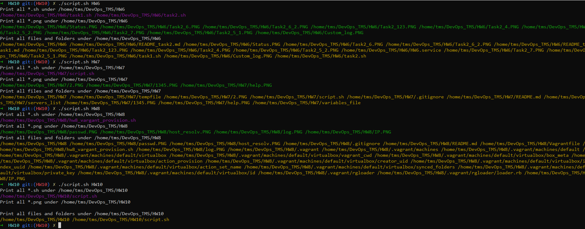

1. Create a small script to print all file’s names with certain extensions recursively(all files under directory and subdirectories). Show all “*.sh” and “*.png” files under your HW?? git folders OR any other location which contains appropriate folders and file structure.
2. Print list of all files and folders under HW?? Git folders OR any other location which contains appropriate folders and file structure.

