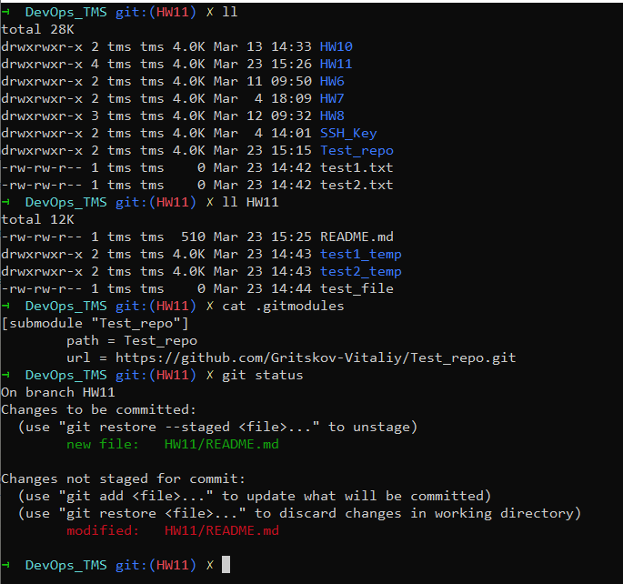

1. Create .gitignore file to ignore all *.txt files for entire repo(recursively)
2. Ignore all *_temp directories only inside particular directory in your repo
3. Ignore test_file inside particular directory
4. Use cherry-pick to copy commit from another branch to your current branch
5. Create git submodule for any git repo
    a. Add submodule
    b. “Checkout” submodule to see it contant
    c. Change submodule to use not latest commit
6. Create fork for any git repo

