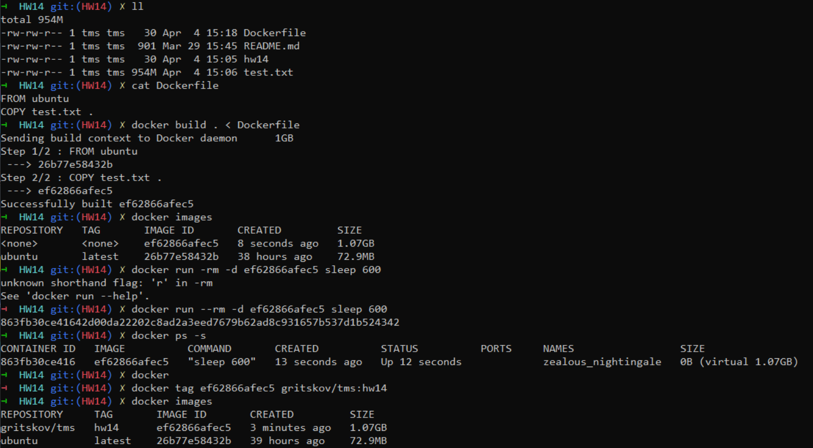

Read docker docs(links are in slides)
1. Run container from ubuntu image
    
    Login to this container
    
    Create file /sizefile with size 1GB
    
    Check docker container size(RW layer and virtual size)
    
    Delete container
2. Create your own image hw14 based on ubuntu image
    
    For this use Dockerfile
    
    Add file /sizefile with size =1GB to Dockerfile
    
    Run container from hw14 images
    
    Check docker container size(RW layer and virtual size)
    
    Push your image to your docker hub account(create if account does not exist)
3. Run containers from ubuntu image
    
    With first mount use bind mount
    
    With second run use volume mount
4. Run nginx container from nginx image.
    
    Map 8081 port to 80 port of nginx container. Check it
    
    Do not use a particular port and get any random port mapped to 80 port of your nginx container.

Task 1

Task 2

Task 3

Task 3

