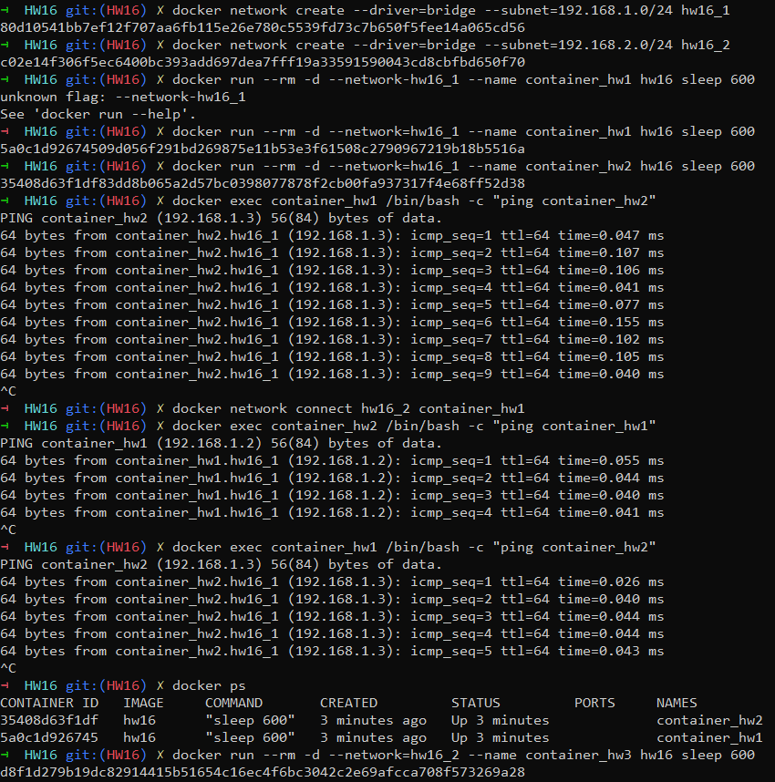
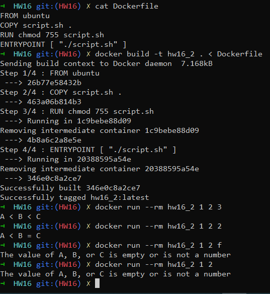
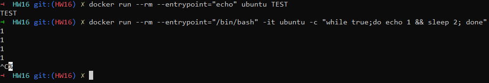
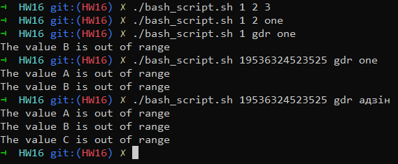

Network:

    1. Create 2 new bridge networks: hw16_1 and hw16_2
    2. Run 2 containers (container_hw1 and container_hw2) in hw16_1  and check that ping works
    3. Change one container_hw1 network to hw16_2 and check if container_hw2 from hw16_1 is accessible.
Dockerfile:

    1. Create a docker image with your script from HW12 task 4
    2. Use this image to print result of the script to container output
        Something like that: docker run --rm myimage 1 1 1 OUTPUT: A equal B and equal C
Docker run

    1. Run container from ubuntu image and rewrite entrypoint:
        a. To do just echo argument provided with docker run: docker run  …. ubuntu TEST return TEST
        b. Using --entrypoint flag execute while true;do echo 1 && sleep 2; done
        Example: docker run --rm --entrypoint …. ubuntu ….

Bash

    1. Create a script to validate 3 incoming arguments. It can be:
        a. Integer from -1000000 to 1000000
        b. One of one two three
    Print an error if even one of input variables is out of defined range. Error should contain which variable is wrong.
    Do this task in two ways

