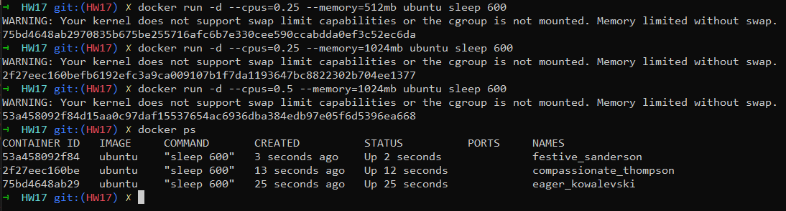
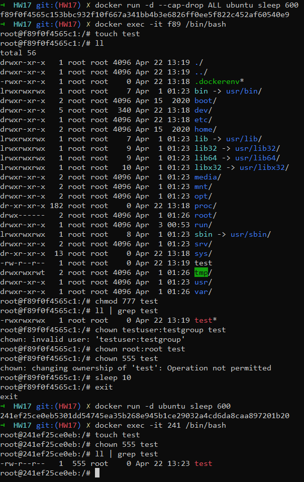
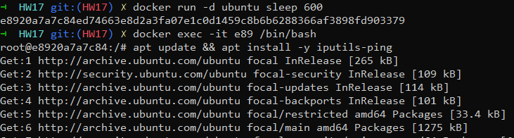
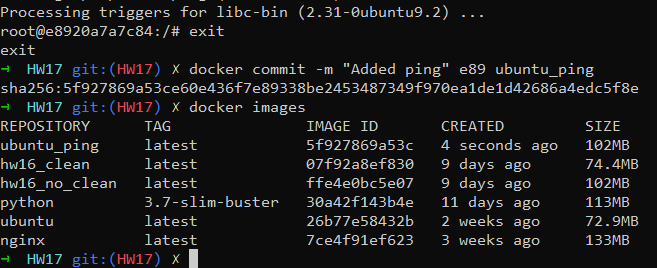
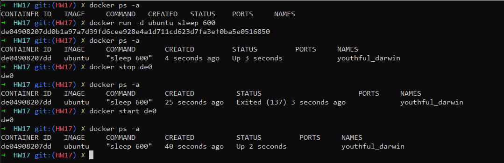
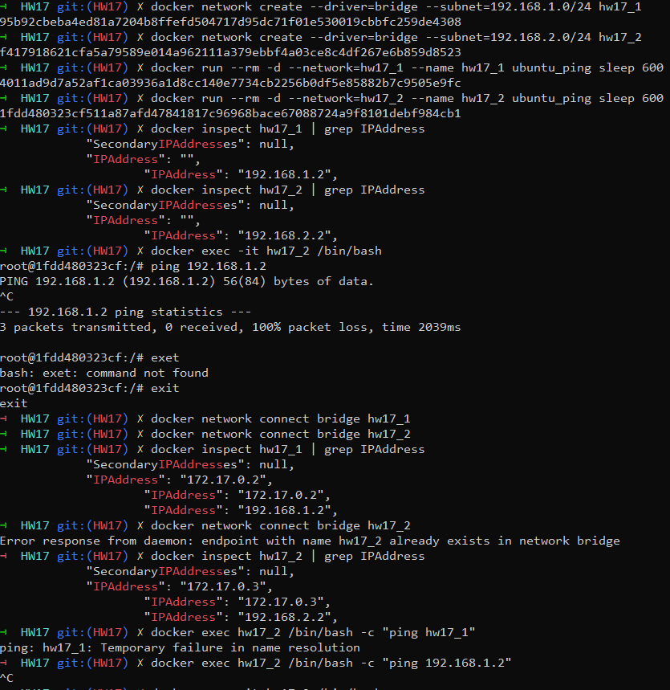
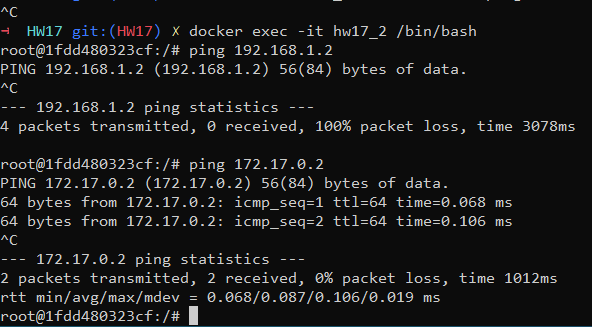
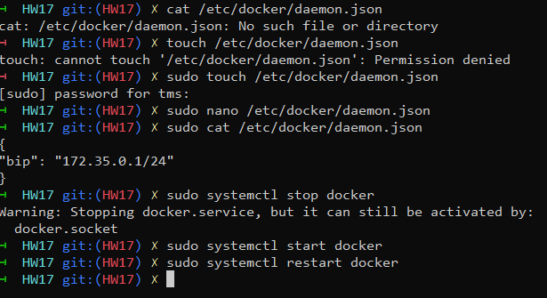
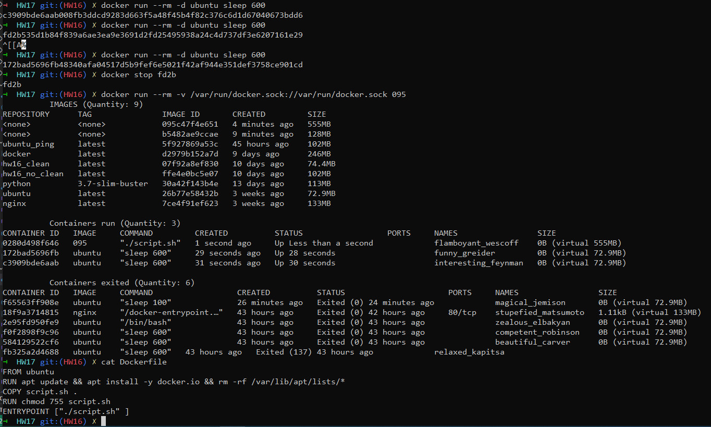

1. Optimize docker file Dockerfile_HW17
2. Any image. Run container with resource restrictions CPU and Memory
3. Any image. Run container with --cap-drop ALL (https://opensource.com/business/15/3/docker-security-tuning)

    a. Check chmod and chown commands inside this container

    b. Check sleep command
4. Run cont from ubuntu image. Install ping utility. Create new image from this running container
5. Run container without --rm option. Stop container. Rerun stopped container. Check that container is running again.
6. Create 2 custom bridge networks. run 2 containers from the image which was created in the previous step - each in a different custom subnet you created. Containers should be able to ping each other.
7. Change default docker bridge network subnet to 172.35.0.1/24
8. Create a docker image which should be able to print all your images and all containers + count of each of them(for example 20 images and 1 container(s) running and 5 container(s) exited). Output should be updated every 30 second

Task 2.

Task 3.

Task 4.

Task 5.

Task 6.

Task 7.

Task 8.

