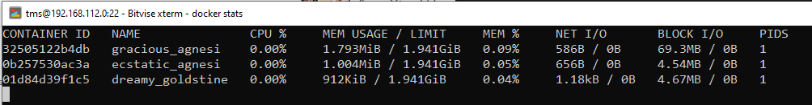
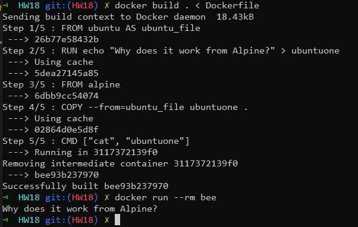
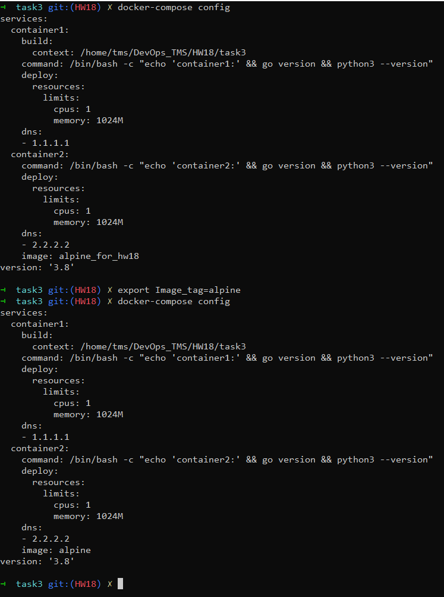
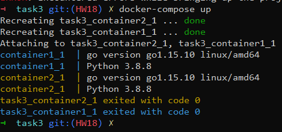

1. How to get docker runtime resource metrics?

2. Create multi stage build https://docs.docker.com/develop/develop-images/multistage-build/ :
Create docker file:

    1. Create file ubuntuone from UBUNTU image with some content.
    2. As a second image use Alpine. Put ubuntuone file from previous stage to / of your new image. Container created from this image should print content of the ubuntuone file

3. Create a docker compose file:

    1. Set image tag as a variable(variables should be provided in 2 ways)
    2. Set MEM and CPU limits for your container
    3. Create Dockerfile with base Alpine  image. Image should contain: ping, curl, tcpdump, traceroute, nc, vim, mysql client, python 3.9, golang latest version
    4. Run compose in 2 ways: Building using docker file from point 3 and from ready image.
    5. When container is running it should print GO and Python version
    6. Set custom DNS for your service

Task 1.

Command: docker stats [name_container]

Task 2.

Task 3. 

If I understood correctly, then in point 3, nc meant netcat-openbsd (https://pkgs.alpinelinux.org/contents?file=nc&path=&name=&branch=edge)

