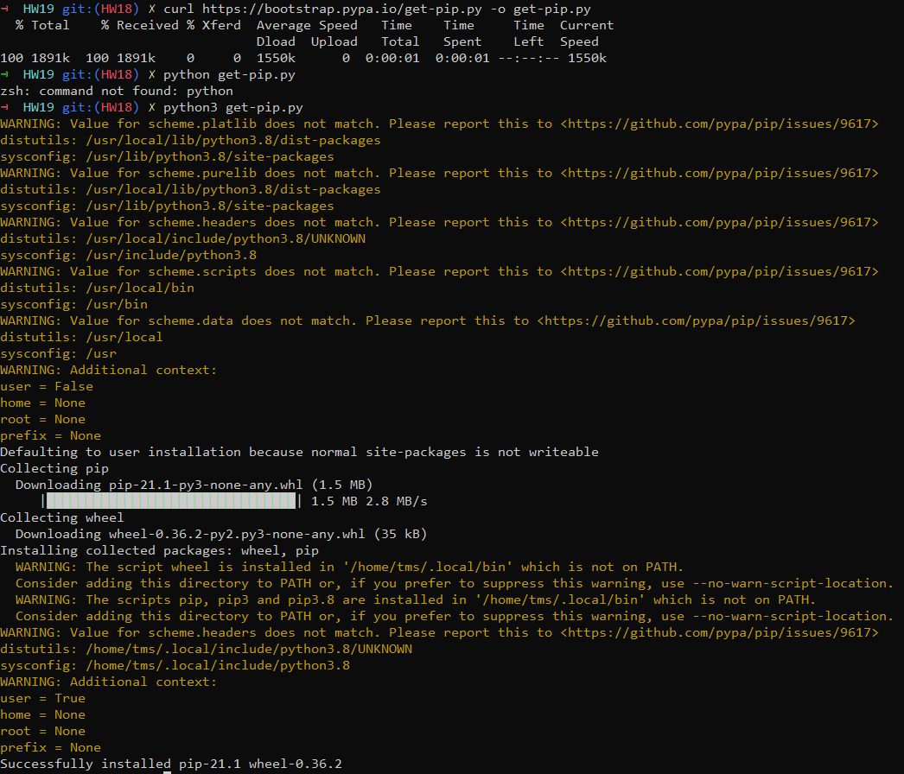
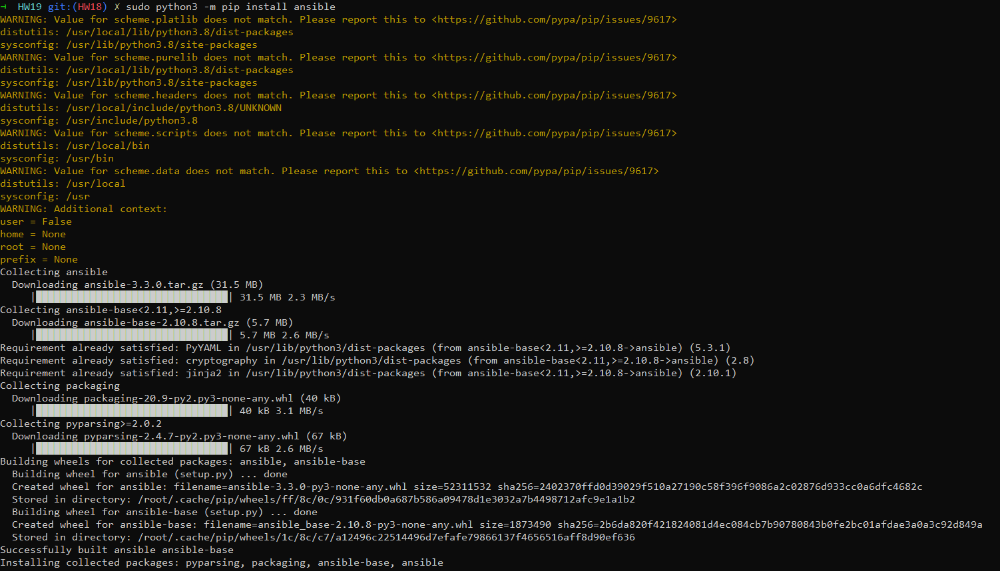
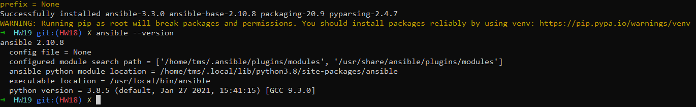
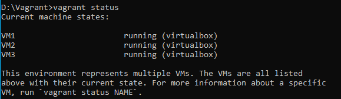
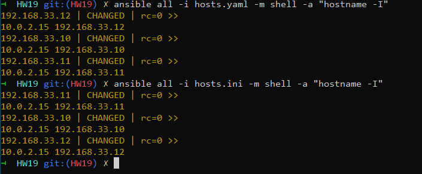
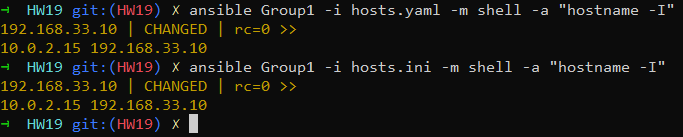

1. Install ansible using pip(Install python3 if needed)
2. With vagrant make it possible to create 2-3 VM

    1. Static IPs
    2. Accessible via port 22
    3. Accessible via custom private key
3. Create ini and yaml hosts files with with 2 or 3 groups inside;

    Group1 Group2 Group3
4. Add one host for each group
5. Run ad-hoc command to print host IP for ALL hosts for both: ini and yaml hosts files
6. Run ad-hoc command only for Group1 host

Task 1.

Task 2.

Task 5. 

Task 6. 

