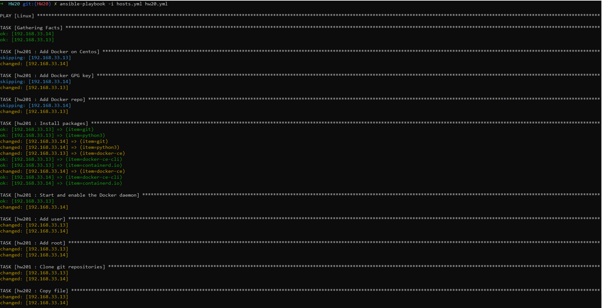
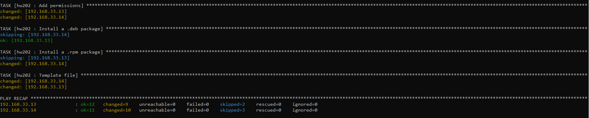
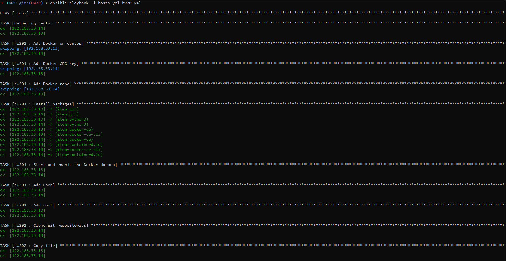
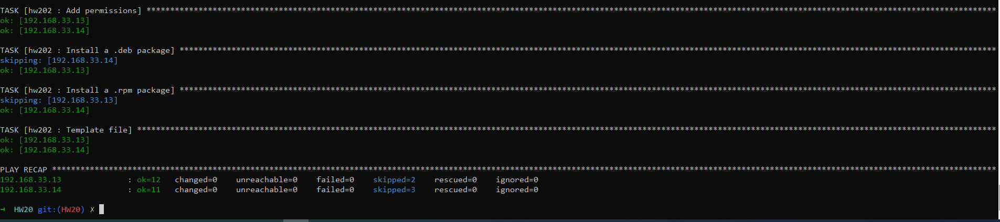
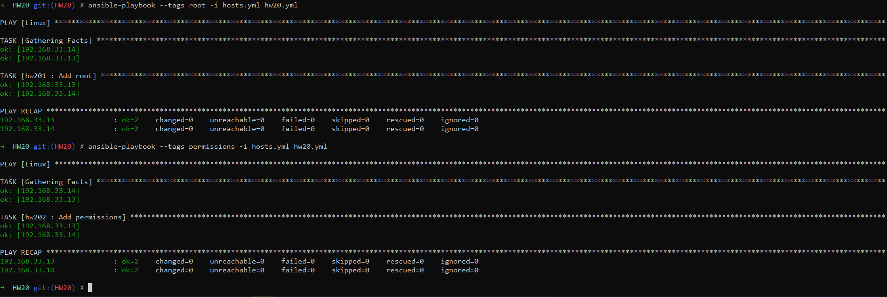
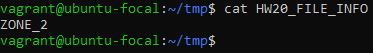
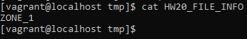

1. Create 2 servers with S1 - ubuntu/focal64 and  S2 - centos/8
2. Create hosts.yml file and define:
    1. ubuntu host group for S1
    2. centos host group for S2
    3. linux host group which include ubuntu and centos groups
3. Create a folder for groups variables. Create folders for ubuntu, centos and linux groups. Add variables for ssh user and ssh key to skip it in the command line.
4. For ubuntu centos groups create a variable group_hw20 with values ZONE_1 and ZONE_2 respectively.
5. Create hw201 role. Add next features to this role. All options should be set as variables:
    1. Install [git,docker,python3] in one task using loop
    2. Create user hw20 with /bin/sh and home folder /opt/hw20.
    3. Create an option to weather add or not user to sudoers group
    4. As user hw20 clone any public git repo to /opt/hw20/
6. Create hw202 role. Add next features to this role. All options should be set as variables:
    1. Add the ability to copy local files to any location.
    2. Install curl from deb(ubuntu) and rpm(centos) packages which located in the role under file folder. 
    3. Add ability to set permissions for these files.
    4. Template. Create a file /HW20_FILE_INFO with content of a variable group_hw20
Put all your roles in playbook hw20.yml
Run roles several times. Compare outputs

Optional
Create systemd service from your previous HW but now do it with ansible in additional role.

Run 1.

Run 2.

Added root for hw20 and permissions for directory tmp.

Template.

