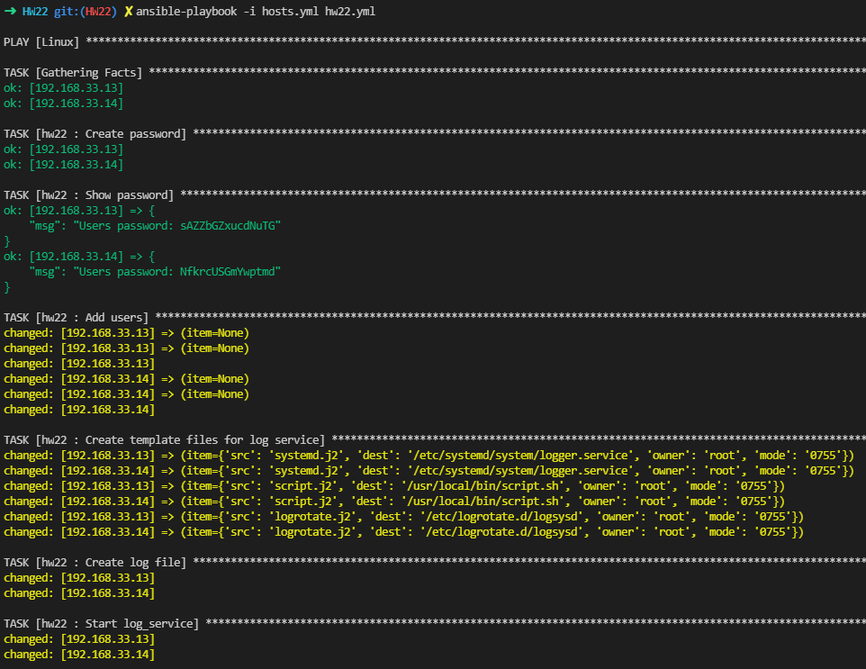
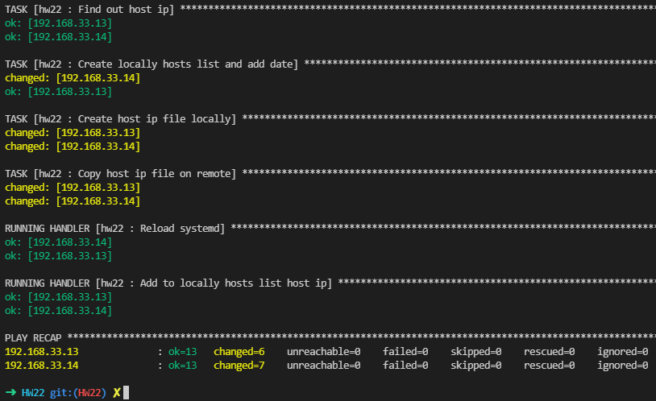
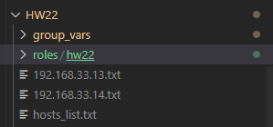
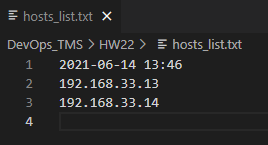
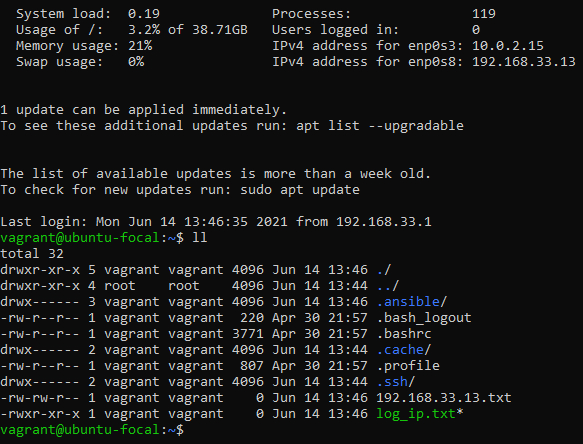
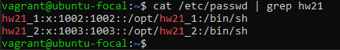
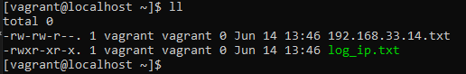
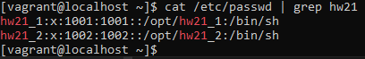

1. Create logrotate(standart linux service) for task 3 HW21 logs. Period and rotate should be set as variable. Compressing should be set as an option.
2. Create users hw21_1 and hw21_2 using only one variable for each user(user_home, shell, groups and so on). Do this with loop and with_*(2 ways). Use when to choose. Do not show output of this task.
3. Update previous task with user password which you should generate with ansible. Print password with separate task.
4. Create a file hosts_list.txt on your local host which should contain date and hosts address playbook running on.
5. Create files with {{hots_ip}}.txt for each your host. Add  task to copy file to remote host base on remote host IP.

