1. Create a role hw23. Inside the role:
    1. Create file /opt/hw23_test_file. Set 644 permissions
    2. Do it  in 2 ways. Rename the file /opt/hw23_test_file to hw23_test_file_exists if file exists(/opt/hw23_test_file) otherwise print debug message that FILE_NAME does not exist.
    3. Create link /opt/hw23_link to /etc/hosts
    4. If  /opt/hw23_link is a link, rename it to hw23_test_file_link. otherwise print debug message that FILE_NAME does not exist or not a link
    5. Run ansible twice to test both cases
2. Inside the role hw23 create separate tasks file hw23_1.yml:
    1. Move packages installation from previous HWs to block sections with adding installation of latest nginx version. Use handlers to restart docker and nginx services.
    2. Create 2 tasks  - one which should have rc=0(set as a variable) another one with rc=2(set as a variable). Print debug message with the task name and rc(use register  and when)
3. Update hw23_1.yml. Add validation of nginx service. Check nginx process is running. If not - restart nginx right after you found that no process exists ad print last 20 lines of nginx log with debug. 

Optional:
Print versions of all installed packages
Separately print list of all installed kernels

First run (Test file and link create):

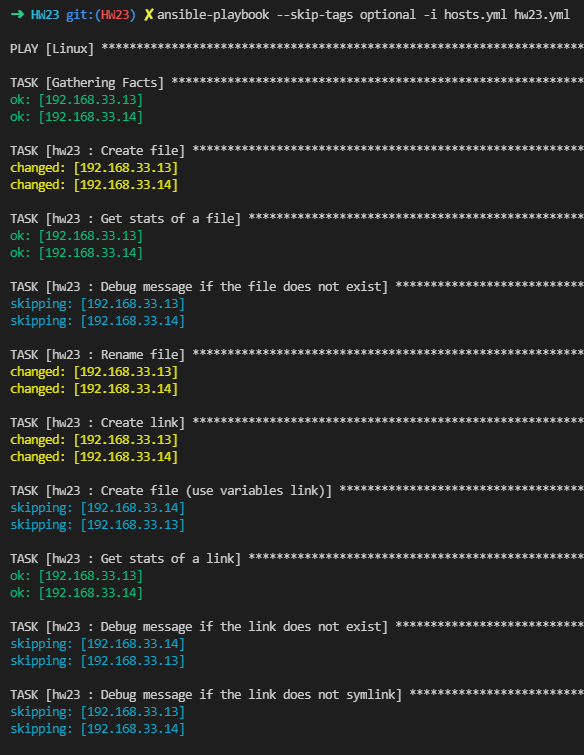
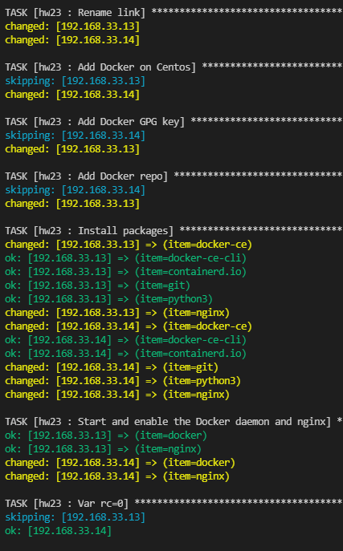
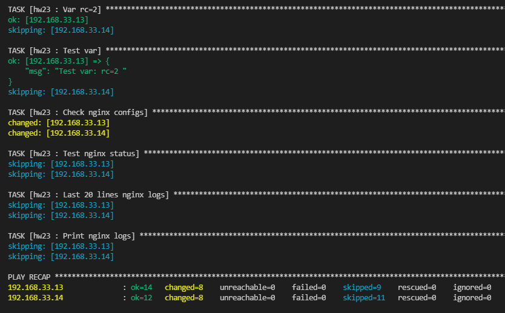

Second run (Test file not create, instead of a link a file)

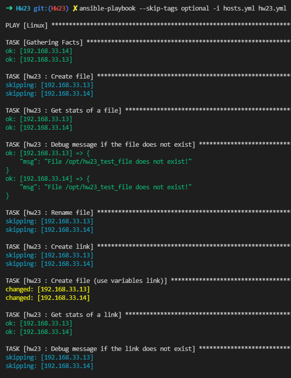
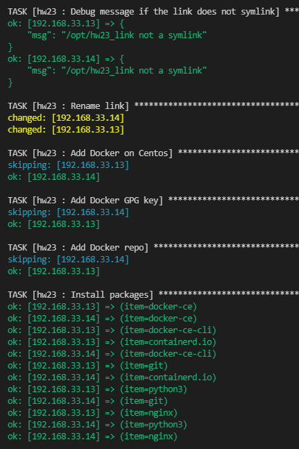
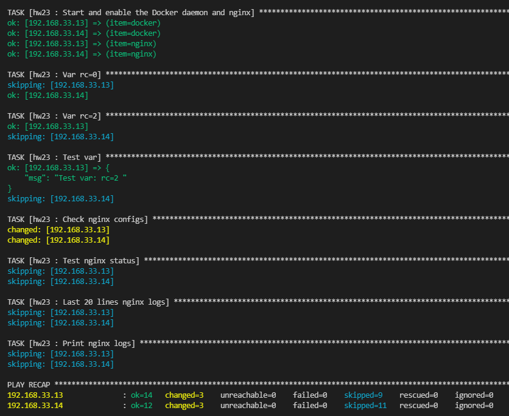

Third run (Test file and link not create)

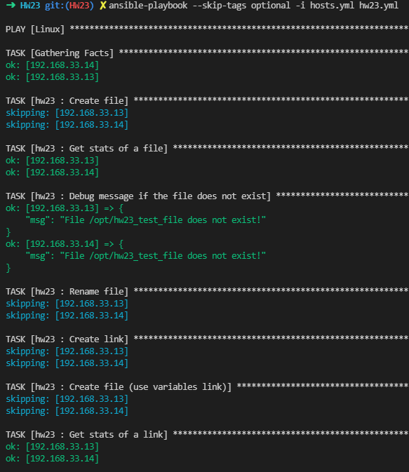
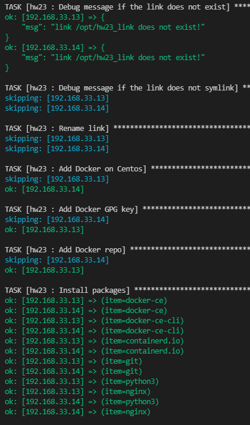
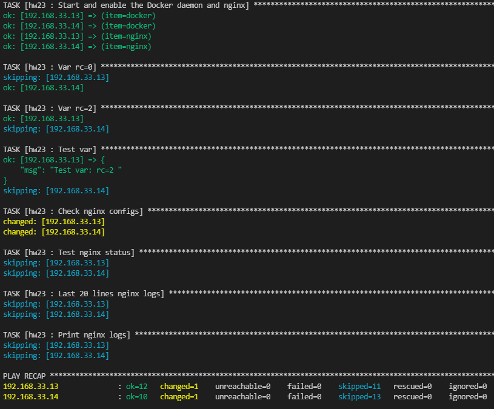

Optional. The output in the terminal is very large and is not saved all for the screenshot. A file with a list of packages is created on remove hosts

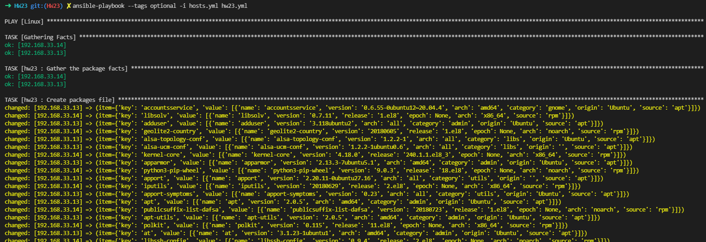
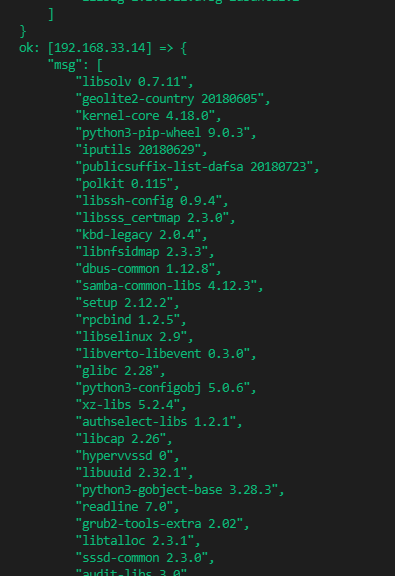
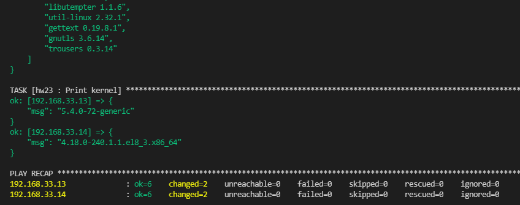
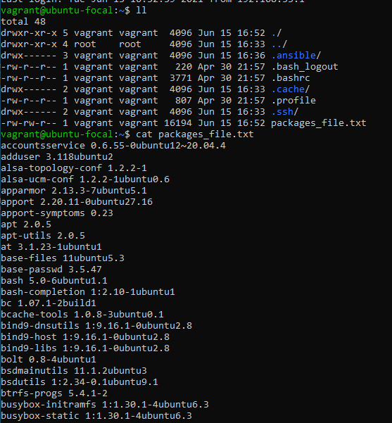
