1. Deploy jenkins(version 2.290) using docker. Make it possible to run docker inside jenkins. Create docker-compose file for this. Create custom jenkins image. https://www.jenkins.io/doc/book/installing/docker/
2. Add ssh key to jenkins home to access vagrant nodes
3. Create manual parameterized pipeline to validate your ansible playbook syntax using tools from previous HWs
4. Run ansible playbook from previous HWs. User name should be provided as parameter
5. Create a schedule for you pipeline
6. Add slave node to your Jenkins master via ssh. Use ansible to provision this node(can be vagrant instance)
7. Attach screenshots of you pipeline configuration

Task 1:

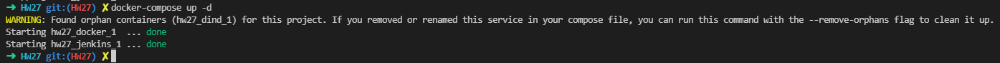
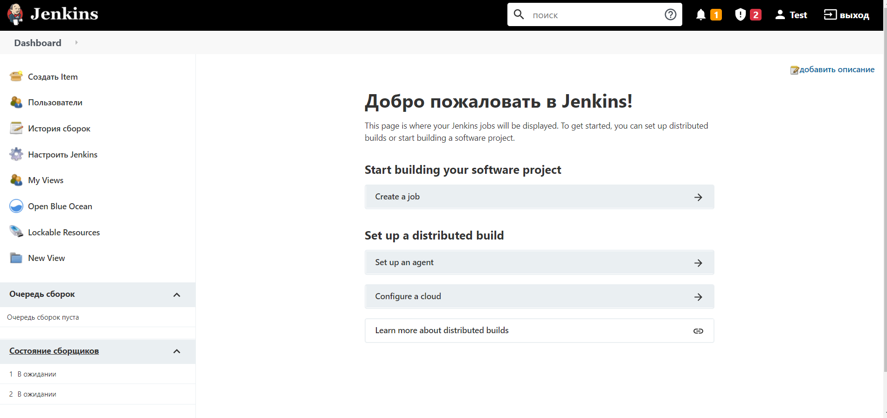

Task 2:

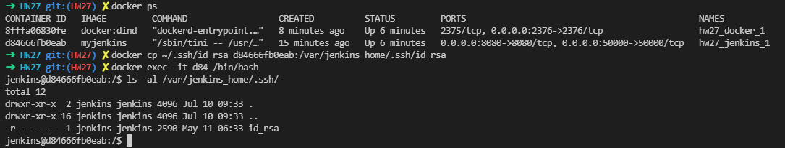

Task 3:

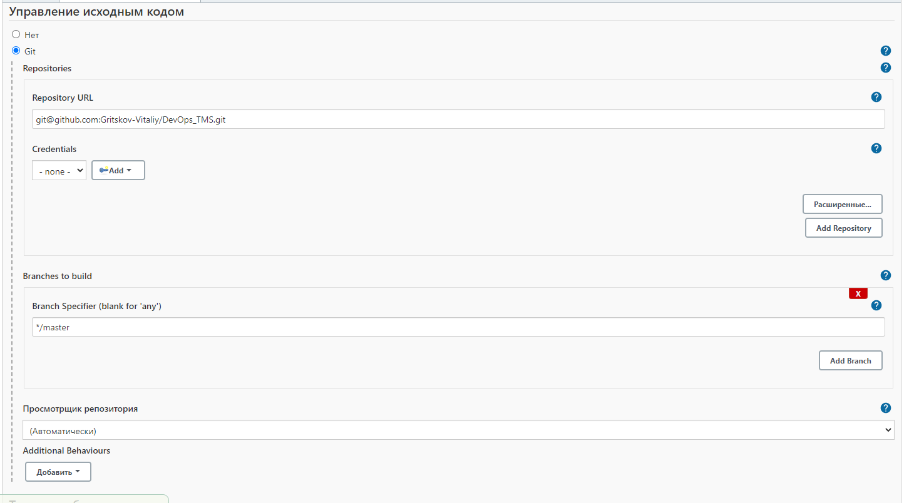
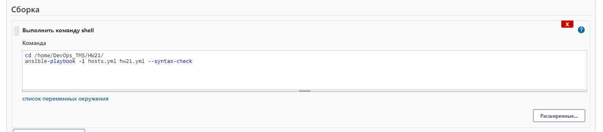
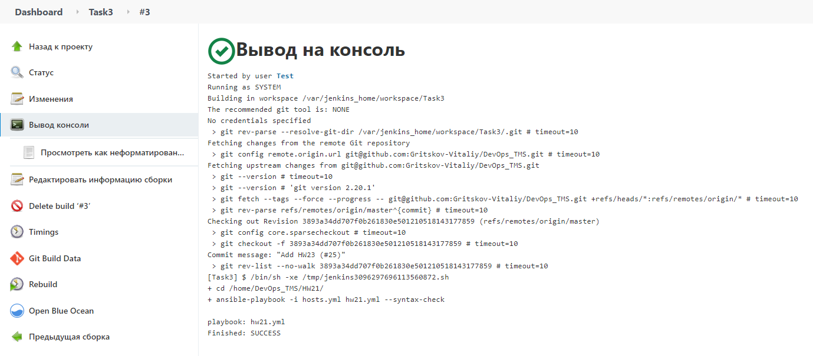

Task 4:

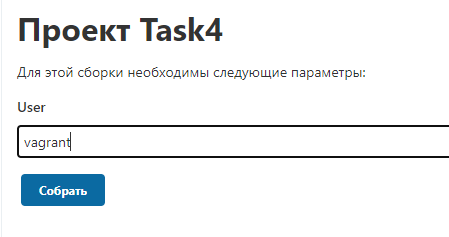
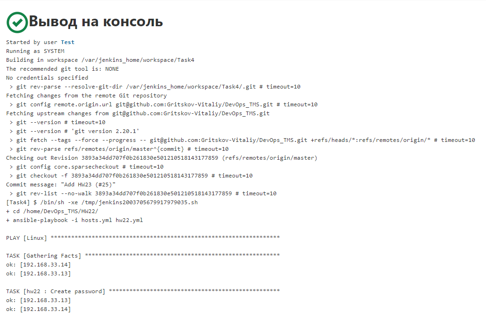

Task 5:

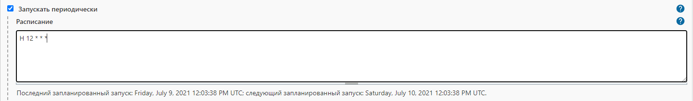

Task 6:

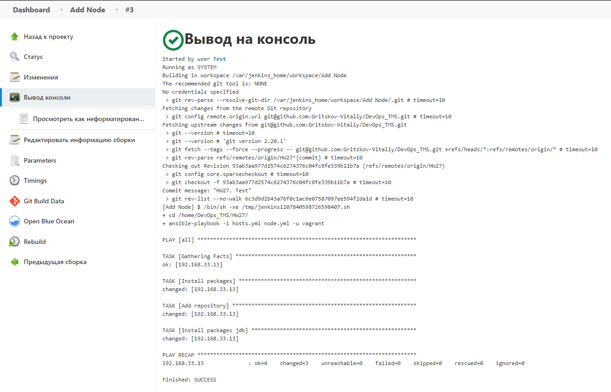
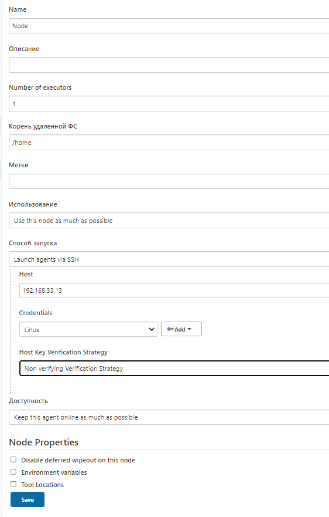
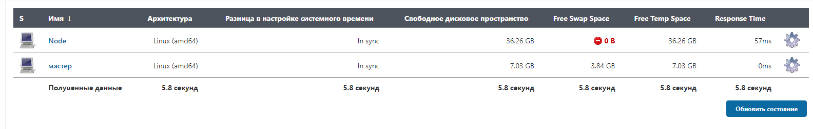

Task 7:

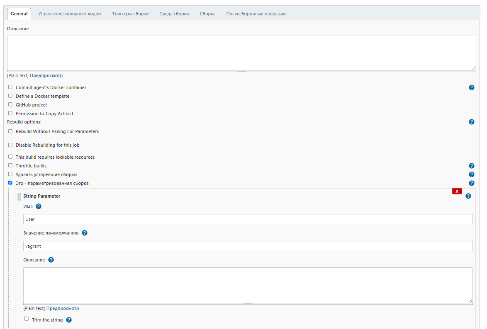
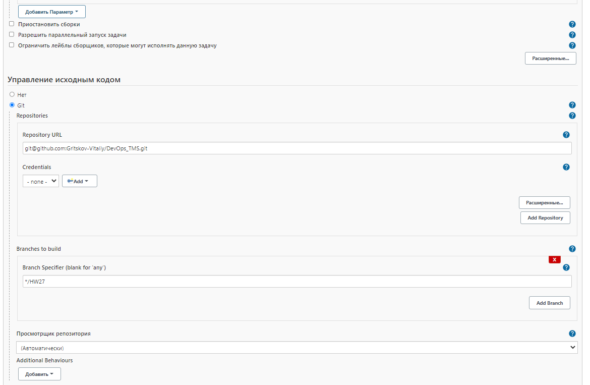
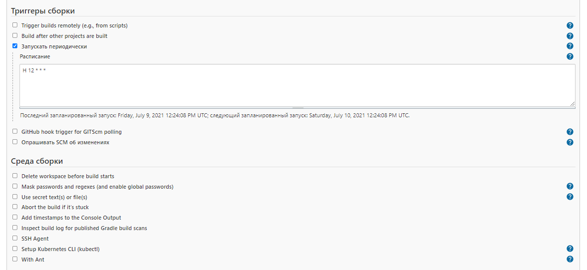
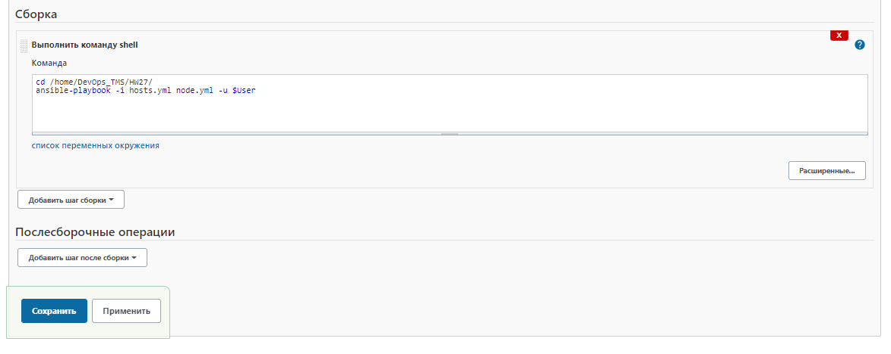
