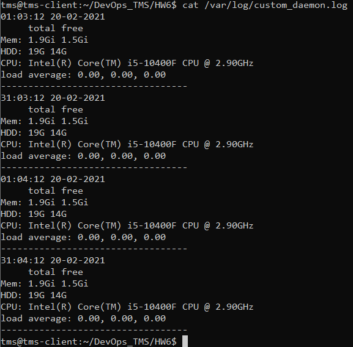
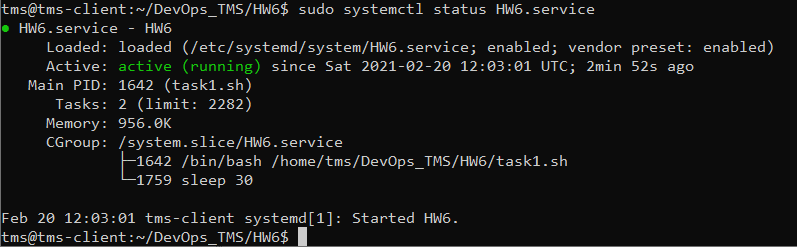

Написать демона(systemd) который будет каждые 30 сек записывать лог в /var/log/custom_daemon.log. В логе должна быть дата в формате секунда:минута:час чиcло месяц год.  Минимальная инфо о системе(mem, cpu info, loadeverage,free disk space)
Добавить скрипт в автозагрузку системы и проверить что все работает

1. Создаём скрипт task1.sh
2. Добавляем HW6.service в папку /etc/systemd/system/
3. Командой sudo systemctl daemon-reload обновляем список сервисов
4. Командой sudo systemctl start HW6.service запускаем сервис с скриптом
5. Командой sudo systemctl enable HW6.service добавляем скрипт в автозагрузку
6. Командой sudo systemctl status HW6.service промеряем работоспособность сервиса
7. Перезапускаем систему
8. Проверяем идёт ли запись в /var/log/custom_daemon.log после перезагрузки

9. Проверяем статус сервиса

