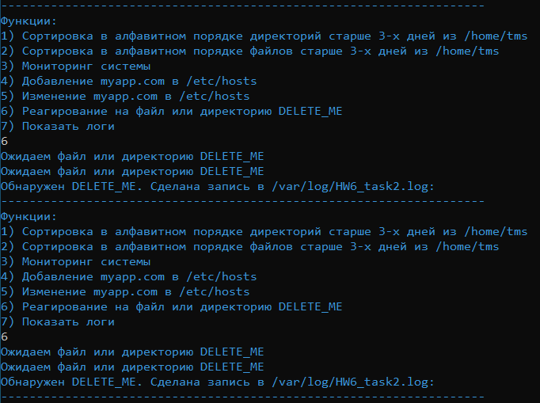

Написать bash script который будет выполнять следующие задачи:
1. Вывести в алфавитном порядке список директорий старше 10, 20(или что то другое) дней из user home(~) + Имя и дата создания/изменения красным цветом
2. Вывести в алфавитном порядке список файлов старше 10, 20 дней из user home(~) + Имя и дата создания/изменения зеленым цветом
3. Вывести общее количество процессов, загрузку по cpu, memory и free space для / раздела. Каждый параметр отдельным цветом

Не по алфавиту, т.к. долго разбирался и не смог найти решение, чтобы получить правильный вывод. В моём скрипте отображаются файлы и директории старше трёх дней. P.S. Cкрины актуальные на 20 февраля
4. Добавлять в /etc/hosts file запись вида: “192.168.3.1 myapp.com” (и не добавлять если такая запись уже есть)

5. Пунк 4 добавить возможность перезаписывать строку содержащую “myapp.com”

Перед проведением пункта 5 почистил hosts от записей с пункта 4. P.S. Небольшое отклонение от задания. Добавил проверку на наличие файла и предложение о добавлении файла при отсутствии (если согласен, то отправляет на пункт 4)
6. Функция которая будет ожидать появления файла или директории с именем DELETE_ME.  После того как DELETE_ME появится - сделать запись в лог, создать в этой директории файл с именем temp(в случае с файлом - записать в него текущее время).

Во втором подключении создавал директорию и файл DELETE_ME

7. Каждое действие оформить в отдельную функцию с комментариями в виде echo.
Скрипт должен писать лог в файл -  дата, действие, номер процесса который ранает скрипт, пользователь который запустил этот скрипт

Ошибку в последней записи уже заметил при составлении README. В коде она исправлена