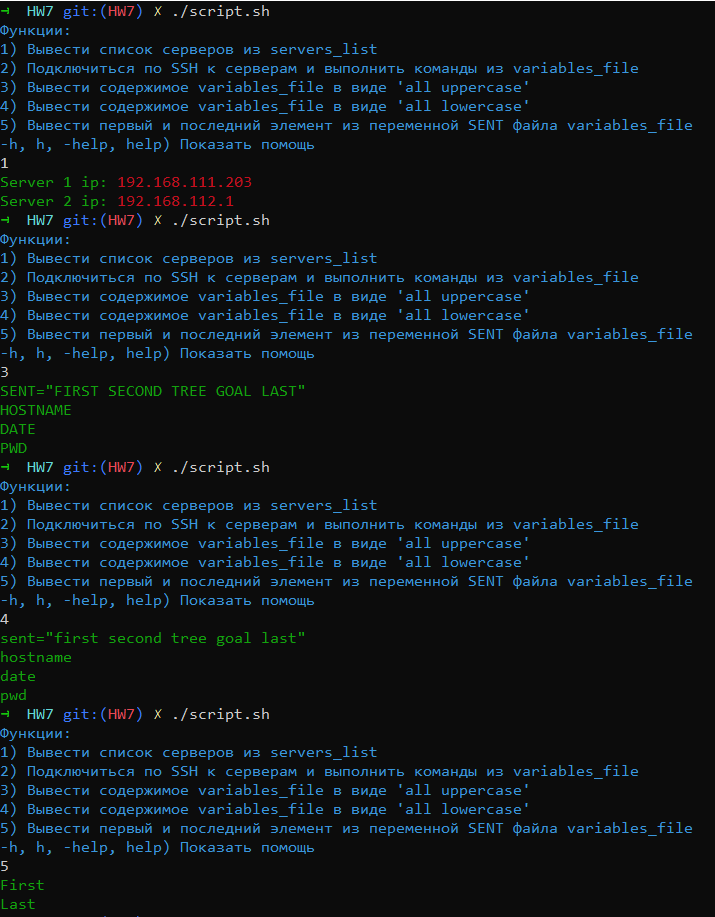
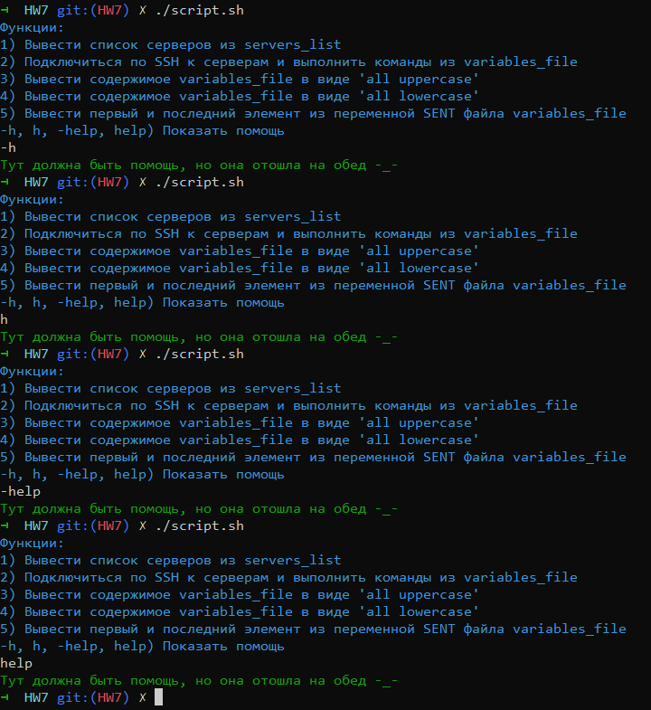
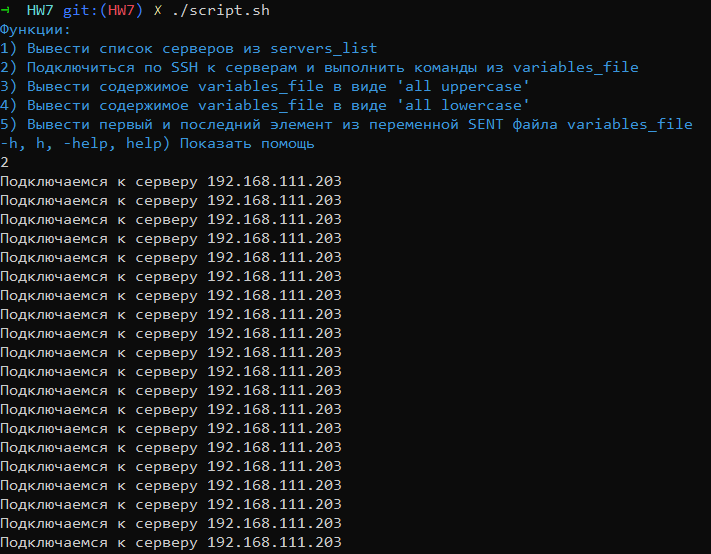

Написать скрипт с функцией help с использованием case
Функции внури скрипта:
1) Вычитать адреса серверов из servers_list файла и вывести их на экран под порядковым номером(Server 1 is: IP, Server 2 is: IP...)
2) Выполнение команд через ssh на серверах, адреса серверов должны быть в файле servers_list. Команда для выполнения должна быть в файле variables_file(пример комманды - hostname)
3) Функция которая делает из стринги all uppercase
4) Функция которая делает из стринги all lowercase
5) Мануально создать переменную в variables_file вида: SENT=”First Second Tree Goal Last”. Написать функцию которая преобразует SENT в массив(array) и распечатает первый и последний элемент нового массива.
Добавить возможность задавать собственную стрингу из inputa
https://opensource.com/article/18/5/you-dont-know-bash-intro-bash-arrays
6) Добавить саму функцию help

На данный момент функция 2 не работает. Вывод такой:
