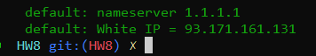
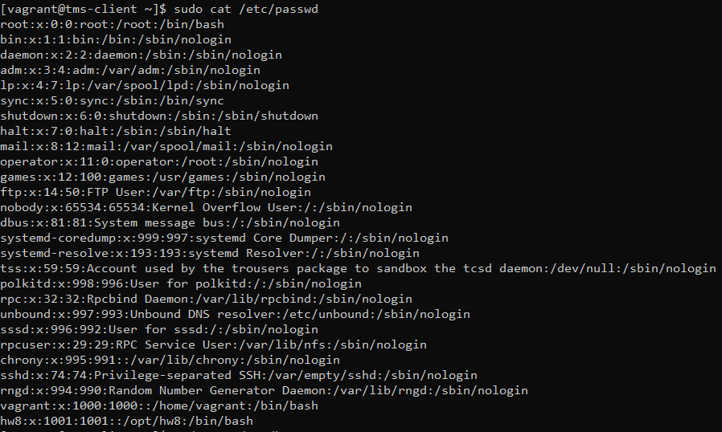
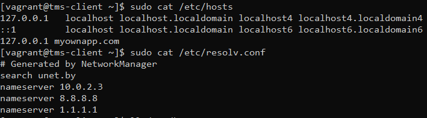
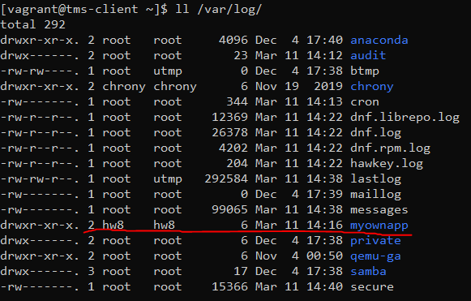

Создать provisioning script для vagrant(Centos 8.3). Instance should have static IP for SSH connection.

https://www.vagrantup.com/docs/cli/provision

https://www.vagrantup.com/docs/provisioning/shell

	Provision script(hw8_vagrant_provision.sh) should do following actions:
		1. Create service user hw8. Home folder = /opt/hw8. Add ssh public key for this user.
		2. Add this user to sudoers group(sudo without password)
		3. Update /etc/hosts file with record “127.0.0.1 myownapp.com”
		4. Restrict ssh with access via password
		5. Restrict ssh root access
		6. Install mc, vim and git packages
		7. Update DNS to 8.8.8.8 and 1.1.1.1
		8. Check that address myownapp.com can be resolved. If not execute step 3
		9. Print external(White) IP of you vagrant centos instance
		10. Create dir /var/log/myownapp and set up hw8 user as owner of the dir

